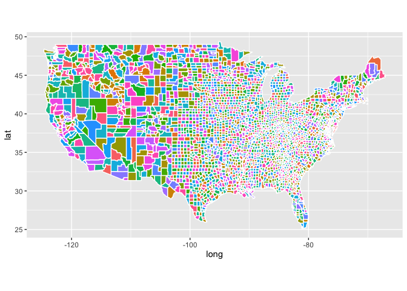
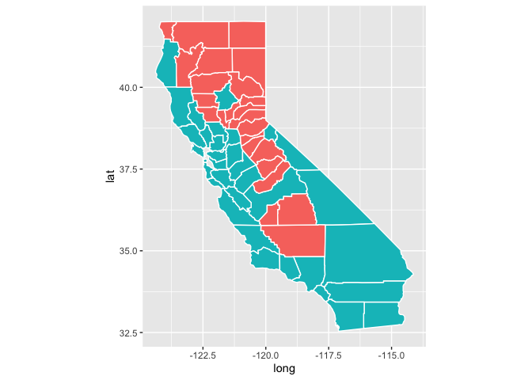

Final Project 131
================
2022-11-27

# <span style="color:blue">Question 1:</span>

#### Dimensions of election.raw:

    ## [1] 32177     5

#### How many NA values are in election.raw:

    ## [1] 0

#### Number of unique states:

    ## [1] 51

The data contains 50 states and the District of Columbia.

# <span style="color:blue">Question 2:</span>

#### Dimensions of election.raw:

    ## [1] 3220   37

#### How many NA values in Census:

    ## [1] 1

#### Number of distinct counties in census:

    ## [1] 3220

#### Number of distinct counties in election.raw:

    ## [1] 2825

There is a lower number of unique counties in election.raw than in the
census dataset, which could mean that some counties were not included in
the election.

# <span style="color:blue">Question 3:</span>

#### Display head of election.state:

    ## # A tibble: 6 × 3
    ## # Groups:   state [2]
    ##   state   candidate             n
    ##   <chr>   <fct>             <dbl>
    ## 1 Alabama Donald Trump    1441168
    ## 2 Alabama Jo Jorgensen      25176
    ## 3 Alabama Joe Biden        849648
    ## 4 Alabama Write-ins          7312
    ## 5 Alaska  Brock Pierce        825
    ## 6 Alaska  Don Blankenship    1127

#### Display head of election.total:

    ## # A tibble: 6 × 2
    ##   candidate          n
    ##   <fct>          <dbl>
    ## 1 Alyson Kennedy  6791
    ## 2 Bill Hammons    6647
    ## 3 Blake Huber      409
    ## 4 Brian Carroll  25256
    ## 5 Brock Pierce   49552
    ## 6 Brooke Paige    1175

# <span style="color:blue">Question 4:</span>

#### Number of presidential candidates in the 2020 election:

``` r
length(unique(election.raw$candidate))
```

    ## [1] 38

#### Display Barchart for each Candidate’s Total Votes:

<!-- -->

# <span style="color:blue">Question 5:</span>

#### Display head of county.winner:

    ## # A tibble: 6 × 6
    ## # Groups:   state, county [6]
    ##   state   county  candidate      pct   tot party
    ##   <chr>   <chr>   <fct>        <dbl> <dbl> <fct>
    ## 1 Alabama Autauga Donald Trump 0.714 19838 REP  
    ## 2 Alabama Baldwin Donald Trump 0.762 83544 REP  
    ## 3 Alabama Barbour Donald Trump 0.535  5622 REP  
    ## 4 Alabama Bibb    Donald Trump 0.784  7525 REP  
    ## 5 Alabama Blount  Donald Trump 0.896 24711 REP  
    ## 6 Alabama Bullock Joe Biden    0.747  3446 DEM

#### Display head of state.winner:

    ## # A tibble: 6 × 3
    ## # Groups:   state [6]
    ##   state      candidate      pct
    ##   <chr>      <fct>        <dbl>
    ## 1 Alabama    Donald Trump 0.620
    ## 2 Alaska     Donald Trump 0.485
    ## 3 Arizona    Joe Biden    0.494
    ## 4 Arkansas   Donald Trump 0.624
    ## 5 California Joe Biden    0.635
    ## 6 Colorado   Joe Biden    0.554

# <span style="color:blue">Question 6:</span>

#### Display Each County In the US

<!-- -->

# <span style="color:blue">Question 7:</span>

#### Display the Colored Map of the Winner of Each State

<!-- -->

Biden is colored as light blue, while Trump is colored as red.

# <span style="color:blue">Question 8:</span>

#### Display the Colored Map of the Winner of Each California County

<!-- -->

Biden represents the light blue, while Trump represents red.

# <span style="color:blue">Question 9:</span>

#### Displaying a Visual for the Census Data:

<!-- -->

# <span style="color:blue">Question 10:</span>

#### Display the First 5 Rows of census.clean:

    ##   CountyId   State         County TotalPop       Men  Women White
    ## 1     1001 Alabama Autauga County    55036 0.4887528  28137  75.4
    ## 2     1003 Alabama Baldwin County   203360 0.4894129 103833  83.1
    ## 3     1005 Alabama Barbour County    26201 0.5334148  12225  45.7
    ## 4     1007 Alabama    Bibb County    22580 0.5425598  10329  74.6
    ## 5     1009 Alabama  Blount County    57667 0.4940434  29177  87.4
    ##   VotingAgeCitizen Income Poverty ChildPoverty Professional Service Office
    ## 1        0.7452576  55317    13.7         20.1         35.3    18.0   23.2
    ## 2        0.7640441  52562    11.8         16.1         35.7    18.2   25.6
    ## 3        0.7735964  33368    27.2         44.9         25.0    16.8   22.6
    ## 4        0.7821966  43404    15.2         26.6         24.4    17.6   19.7
    ## 5        0.7372154  47412    15.6         25.4         28.5    12.9   23.3
    ##   Production Drive Carpool Transit OtherTransp WorkAtHome MeanCommute  Employed
    ## 1       15.4  86.0     9.6     0.1         1.3        2.5        25.8 0.4381132
    ## 2       10.8  84.7     7.6     0.1         1.1        5.6        27.0 0.4402390
    ## 3       24.1  83.4    11.1     0.3         1.7        1.3        23.4 0.3388420
    ## 4       22.4  86.4     9.5     0.7         1.7        1.5        30.0 0.3618689
    ## 5       19.5  86.8    10.2     0.1         0.4        2.1        35.0 0.3707493
    ##   PrivateWork SelfEmployed FamilyWork Unemployment Minority
    ## 1        74.1          5.6        0.1          5.2     22.8
    ## 2        80.7          6.3        0.1          5.5     15.4
    ## 3        74.1          6.5        0.3         12.4     52.8
    ## 4        76.0          6.3        0.3          8.2     24.8
    ## 5        83.9          4.0        0.1          4.9     10.9

<!-- -->

Using the correlation matrix, we see that we have one perfect
colinearity between White and Minority. Therefore, we can take out the
white variable.

# <span style="color:blue">Question 11:</span>

Mean of each column in census.clean

Variance of each column in census.clean:

I did both centering and scaling for PCA. In terms of centering, we
should center because centering is required in order to perform PCA. In
terms of scaling, Since most of the data points have vastly different
means and variances, we can perform PCA with scaled values.

Top 3 largest absolute values of PC1:

    ##                    PC1
    ## ChildPoverty 0.3895535
    ## Poverty      0.3871282
    ## Employed     0.3721068

Among the three variables, Poverty and ChildPoverty have a positive
sign, while Employed is a negative sign. This means that Poverty and
ChildPoverty are positively correlated with each other, while Employed
is negatively correlated with Poverty and ChildPoverty.

# <span style="color:blue">Question 12:</span>

    ##  [1] 0.2195560 0.3558879 0.4818307 0.5547350 0.6087571 0.6579658 0.7033740
    ##  [8] 0.7460702 0.7841610 0.8195951 0.8515675 0.8820195 0.9058760 0.9278966
    ## [15] 0.9450450 0.9583440 0.9697417 0.9788285 0.9859610 0.9913343 0.9952680
    ## [22] 0.9982103 0.9999966 1.0000000

The minimum number of PCs needed to capture 90% of the variance for the
analysis is 13.

#### PVE Plot

<!-- -->

#### Cumulative PVE Plot

<!-- -->

# <span style="color:blue">Question 13:</span>

#### Cluster for the census.clean dataset:

<!-- -->

#### Cluster for the first 2 PCs dataset

<!-- -->

Our census.clean cluster has 2 highly voted equal county winners, with
not many candidates winning many counties. Our pc cluster, however, has
1 clear majority county winner, with a large gap between the others.
However, 2 and 5 have a lot of county winners. Neither plots make very
much sense, unless Trump and Biden won a similar amount of counties for
the first plot or there was another candidate who won lots of counties
in the second plot.

#### Investigating Cluster containing SB County

``` r
# Census cluster in SB county
print(census.clus[228])
```

    ## [1] 2

``` r
# PC cluster in SB county
print(pc.clus[228])
```

    ## [1] 1

When we see the clustering, SB county is placed more appropriately in
the census cluster since we mainly just want two clusters with a lot of
observations since there were mainly just 2 candidates who won every
county. So PC clustering wouldn’t make much sense because there are more
than 2 candidates winning each county.

# <span style="color:blue">Question 14:</span>

We need to exclude the predictor party from election.cl since it’s
perfectly colinear with the candidate. The candidate and the party will
always be the same relation no matter what. Therefore, it will not only
be bad for our machine learning methods, but they are also redundant and
take up computational time.

# <span style="color:blue">Question 15:</span>

#### Visualizing pre-pruned tree

<!-- -->

#### Visualizing the Pruned Tree

<!-- -->

Using the pruned plot, we get a similar error rate to the decision tree
but with much smaller size and lesser overfitting. The pruned tree is
also much easier to interpret.

We get around a 6.6% train error rate (93.4 accuracy) and a 8.74% test
error rate (91.26 accuracy) when we use the tree in predicting whether
Trump or Biden wins a county. However, this accuracy score may be a
little bit misleading because Trump has won at least 6 times as many
counties as Biden. Therefore, if we predict all counties to have Trump
as the winner, we would still get around an 85% accuracy score.

Using the pruning plot, we see that minorities tend to vote for Biden,
as we see than a minority rate of less than 48.85% leads to Trump
winning given Transit rate is less than 0.95%, while minority greater
than 53.15 leads to Biden winning given several conditions. We also see
that transit best splits the data. Therefore, transit plays a big role
in determining the winner of the county. This makes sense as urban
populations with lots of transit rates tend to vote for Biden, while
Trump gets lots of votes from rural/suburban areas.

# <span style="color:blue">Question 16:</span>

    ## 
    ## Call:
    ## glm(formula = candidate ~ ., family = binomial, data = election.cl[idx.tr, 
    ##     ])
    ## 
    ## Deviance Residuals: 
    ##     Min       1Q   Median       3Q      Max  
    ## -2.7574  -0.2345  -0.0955  -0.0326   3.3515  
    ## 
    ## Coefficients:
    ##                      Estimate   Std. Error z value             Pr(>|z|)    
    ## (Intercept)      -46.27071898   6.49489383  -7.124 0.000000000001047108 ***
    ## TotalPop           0.00002957   0.00003046   0.971             0.331631    
    ## Men               -0.02115421   4.89708653  -0.004             0.996553    
    ## Women             -0.00005551   0.00005983  -0.928             0.353487    
    ## VotingAgeCitizen  16.02865682   2.56292677   6.254 0.000000000399958200 ***
    ## Income            -0.00001203   0.00001589  -0.757             0.448813    
    ## Poverty            0.02781443   0.04056867   0.686             0.492957    
    ## ChildPoverty       0.00478902   0.02354077   0.203             0.838795    
    ## Professional       0.31312059   0.03864751   8.102 0.000000000000000541 ***
    ## Service            0.33253935   0.04435588   7.497 0.000000000000065258 ***
    ## Office             0.17467435   0.04615592   3.784             0.000154 ***
    ## Production         0.19134084   0.03917155   4.885 0.000001035923631693 ***
    ## Drive             -0.14058453   0.03538674  -3.973 0.000071031907678005 ***
    ## Carpool           -0.09978044   0.04912908  -2.031             0.042256 *  
    ## Transit            0.27599284   0.08798227   3.137             0.001707 ** 
    ## OtherTransp        0.13903843   0.09194993   1.512             0.130506    
    ## WorkAtHome        -0.00340016   0.06459919  -0.053             0.958023    
    ## MeanCommute        0.02114094   0.02284194   0.926             0.354689    
    ## Employed          25.69092030   3.22828963   7.958 0.000000000000001748 ***
    ## PrivateWork        0.05132459   0.02137367   2.401             0.016337 *  
    ## SelfEmployed      -0.01789962   0.04648259  -0.385             0.700177    
    ## FamilyWork        -0.64876518   0.30499713  -2.127             0.033410 *  
    ## Unemployment       0.28941359   0.04808066   6.019 0.000000001751350561 ***
    ## Minority           0.12420385   0.00954414  13.014 < 0.0000000000000002 ***
    ## ---
    ## Signif. codes:  0 '***' 0.001 '**' 0.01 '*' 0.05 '.' 0.1 ' ' 1
    ## 
    ## (Dispersion parameter for binomial family taken to be 1)
    ## 
    ##     Null deviance: 2184.88  on 2470  degrees of freedom
    ## Residual deviance:  800.33  on 2447  degrees of freedom
    ## AIC: 848.33
    ## 
    ## Number of Fisher Scoring iterations: 7

Significant variables (variables with p-value of less than 0.05) include
VotingAgeCitizen, Professional, Service, Office, Production, Drive,
Carpool, Transit, Employed, PrivateWork, FamilyWork, Unemployment, and
Minority.

These significant variables are consistent with what is shown in the
tree, with common significant variables in VotingAgeCitizen,
Professional, Service, Transit, PrivateWork, Unemployment, and Minority.

- For every one unit change in VotingAgeCitizen, the log odds of the
  winner being Joe Biden increases by 16.028.
- For every one unit change in Minority, the log odds of the winner
  being Joe Biden increases by 16.028.
- For every one unit change in FamilyWork, the log odds of the winner
  being Biden decreases by -0.648.

# <span style="color:blue">Question 17:</span>

#### Optimal lambda value in cross-validation

    ## [1] 0.00103631

#### Our Coefficients from LASSO

    ## 24 x 1 sparse Matrix of class "dgCMatrix"
    ##                                s1
    ## (Intercept)      -41.227411443991
    ## TotalPop           0.000001020916
    ## Men                .             
    ## Women              0.000001245261
    ## VotingAgeCitizen  17.254661901040
    ## Income             .             
    ## Poverty            0.048241312081
    ## ChildPoverty       .             
    ## Professional       0.240054166090
    ## Service            0.268703458125
    ## Office             0.104083658489
    ## Production         0.117416064334
    ## Drive             -0.118687410395
    ## Carpool           -0.084193713109
    ## Transit            0.170726777346
    ## OtherTransp        0.089269422602
    ## WorkAtHome         .             
    ## MeanCommute        0.012160765349
    ## Employed          22.673228730260
    ## PrivateWork        0.054383397910
    ## SelfEmployed      -0.039573263183
    ## FamilyWork        -0.510021153636
    ## Unemployment       0.203312037069
    ## Minority           0.116821866102

The non-zero coefficients in the lasso regression include TOTALPOP,
WOMEN, VotingAgeCitizen, POVERTY, Professional, Service, Office,
Production, Drive, Carpool, Transit, Employed, PrivateWork, FamilyWork,
Unemployment, and Minority. (Where variables not in caps are also in the
unpenalized logistic regression)

The lasso logistic regression’s nonzero coefficients contains all of the
unpenalized logistic regression variables that are statistical
influencers on the outcome variable.

This means that lasso placed importance on these variables to influence
the candidate winner and took out all the other variables that didn’t
have any statistical influence on the candidate winner. Thus, we keep
all of the unpenalized logistic regression variables that are
significant, but take out some variables that are not.

#### Final Records Table:

    ##          train.error test.error
    ## tree      0.06596520 0.08737864
    ## logistic  0.06556050 0.06957929
    ## lasso     0.06313234 0.06472492

# <span style="color:blue">Question 18:</span>

<!-- -->

The RED is for the tree, GREEN is for the unpenalized logistic
regression, and the BLACK is the logistic regression using LASSO.

Based on the results, we can see that the logistic and lasso regression
showed much better performance. On the other hand, the tree did not
perform as well. However, the logistic regression is much less
interpretable than the tree, since for the tree, we have our splits of
our variables which determine their importance and also the threshold at
which they split. This gives the reader a better idea of how each
variable influences the outcome variable. The tree is also more prone to
overfitting. The tree can be trained on a small training dataset while
the logistic regression requires a large dataset to work well.

The KNN classifier is not as appropriate as logistic regression since
KNN doesn’t work with large datasets and it suffers from the curse of
dimensionality where there are too many predictor variables. LDA and QDA
are not appropriate since it has to assume that the observations follows
a normal distribution, which it doesn’t. SVM does seem appropriate as
there isn’t any cons to using SVM in this dataset with the exception
that SVM performs well on high dimensional but small observational data,
but logistic regression using LASSO so far is the most accurate thus the
most appropriate way.

Also, some of our features have very high variance which means we have
noisy features in our dataset, thus SVM and boosting would not work very
well as they cannot handle noisy data very well.

# <span style="color:blue">Question 19:</span>

#### We will first try to use KNN CV to predict each county winner.

    ## [1] 0.1440129

We get 0.15 as the error rate for our cv knn model. This performed
poorly in comparison to the previous tree/lasso/logistic models we used.

#### For our 2nd Classification method, we will use Random Forests

    ## [1] 0.07605178

For our random forest, we get around a 7% error rate, which isn’t as bad
as the tree/lasso/logistic, but not the best method to find the lowest
error rate.

#### For our 3rd Classification method, we will use Boosting

    ## [1] 0.07443366

Similar to the random forest, our boosting gets us around 7% error rate.

#### For our 4th Classification method, we will use SVM

    ## [1] 0.06957929

SVM also gets us around 7% error rate

In conclusion, LASSO has the lowest error rate out of all our 7 machine
learning models we used.

# <span style="color:blue">Question 20:</span>

#### We will first try to predict the number of total votes for each winner candidate using Lasso Linear Regression

#### MAE for lasso linear regression

    ## [1] 6779.006

Our mae isn’t too bad as it’s saying we’re on average around 6,779
people off from the actual count of how many each county winner got. We
can run this on our test dataset including some counties to see how they
compare.

``` r
predictions <- round(predict(lasso_reg.mod, s = bestlam, newx = model.matrix(tot~., reg.te)[,-1]))

a <- cbind(election.reg[-idx.tr, ], predictions) %>% select(state, county, candidate, tot, s1)
a[c(1:10),]
```

    ##      state     county    candidate   tot    s1
    ## 1  alabama       bibb Donald Trump  7525  8342
    ## 2  alabama    bullock    Joe Biden  3446  2600
    ## 3  alabama   crenshaw Donald Trump  4864  3411
    ## 4  alabama     greene    Joe Biden  3884  2390
    ## 5  alabama      henry Donald Trump  6607 10870
    ## 6  alabama    marengo    Joe Biden  5488  8442
    ## 7  alabama montgomery    Joe Biden 64529 66044
    ## 8  alabama     morgan Donald Trump 39664 35161
    ## 9  alabama      perry    Joe Biden  3860  3681
    ## 10 alabama tallapoosa Donald Trump 14963 16500

It looks like our predictions aren’t too far off from the actual, with
some weird, negative exceptions. This is completely different from the
classification models since we’re not trying to predict the winner
(Trump or Biden), but rather a number predicting how many votes someone
got if they won the county. This would be a pretty good analysis if you
were a manager for a candidate and you wanted to predict how many votes
you would need to win a certain county (If elections were based on the
winners of a county) in order to win the county as cost efficient and
time efficient as possible.

# <span style="color:blue">Question 21:</span>

One thing that really confused me was the clustering part of our
question. When I looked back on the dimension reduction, I felt like
neither method (census clustering vs pca clustering) really worked,
since Trump won a majority of counties, but no one else really won
except for Trump, Biden or a few write-ins. Therefore, a barplot of the
clustering should look like a lot of votes for one candidate, a moderate
amount of votes for one candidate, and hardly any votes for the 3rd
candidate, but both our barplots did not achieve this result.

We can visualize how our data ended up by classifying how our clusters
performed. However, we must redo our cluster on our election.cl dataset
instead of census.clean to successfully run our code (results changed
but we should still see a similar pattern)

#### We can find how many clusters labeled as 1 belong to Trump and 2 to Biden to measure how many the clusters correctly predicted Trump or Biden

#### For Trump:

    ## [1] 0.7401942

The unsupervised clustering has correctly predicted that Trump was the
winner 74% of the time.

#### For Biden:

    ## [1] 0.2782101

However, the unsupervised clustering correctly predicted Biden was the
winner 26% of the time.

#### Overall Accuracy Score

    ## [1] 0.6633215

#### Now, we try the same thing with the PCA. Here we have majority labeled as ‘1’ and 2nd most as ‘7’ so we will set Trump according to 1 and Biden to 7.

#### Trump Accuracy Score

    ## [1] 0.6038835

The unsupervised PCA has correctly predicted that Trump was the winner
60% of the time.

#### Biden Accuracy Score

    ## [1] 0.2315175

The unsupervised PCA has correctly predicted that Trump was the winner
23% of the time.

#### Overall Accuracy Score

    ## [1] 0.541923

PCA Overall accuracy has a significant lower accuracy score than the
census. Thus, despite lowering the amount of dimensions, it is not worth
having a much lower accuracy score.

In conclusion, it’s a bit hard to predict on this dataset because most
of the dataset have the county winner as Trump. If we’re getting such a
low accuracy score for Biden, the clustering method is essentially just
making guesses.

If we have a dataset that has an equal outcome split, we can more
accurately determine which model or clustering method works best, albeit
getting a lower accuracy score. If we consider that Trump has won a
majority of the counties in general, our clustering accuracy score tells
us that both the PCA and regular features are technically guessing and
it isn’t really appropriate to use this method for both.
